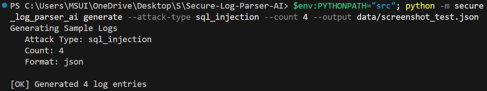
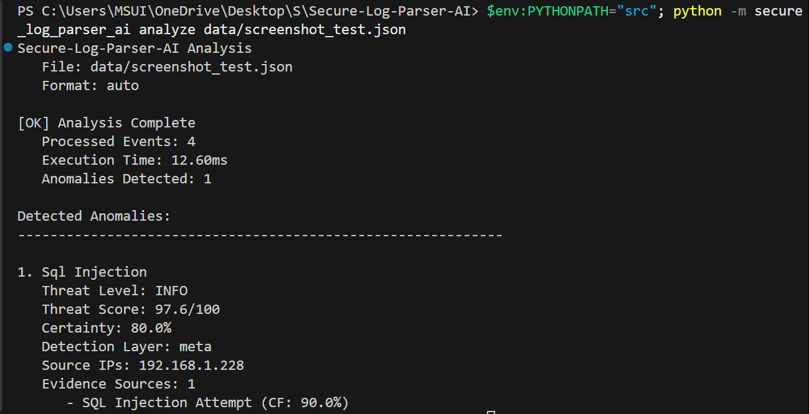

# Secure-Log-Parser-AI

## A Journey into AI-Powered Cybersecurity

---

*"In a world where cyber threats evolve faster than ever, we need systems that don't just process data—they need to understand it, reason about it, and explain their decisions. This project is my attempt to bridge the gap between classical AI and modern cybersecurity."*

---

A Python-based **Expert System** implementing rule-based anomaly detection with probabilistic reasoning for cybersecurity log analysis. 

This project was completed by **Taki Eddine Rami** under the supervision and guidance of:
- **Pr. Tag Samir** (Cybersecurity)
- **Pr. Menassel Yahia** (Artificial Intelligence)
- **Pr. Zebdi Abdel Moumen** (Compilation)
- **Pr. Chergui Othaila** (Semi-Structured Data)

## Overview

Secure-Log-Parser-AI is an intelligent system that thinks, reasons, and explains its findings like a human security analyst. It addresses the "black box" problem of modern ML by providing natural language justifications for every detection.

### Key AI Concepts Implemented
- **Expert Systems** with forward-chaining inference
- **Knowledge Representation** using frames and semantic networks
- **Uncertainty Handling** via Certainty Factor algebra (MYCIN-style) and Dempster-Shafer theory
- **Multi-layer Detection** combining signature, statistical, and behavioral analysis
- **Simplified Rete network** for efficient rule matching

---

## Architecture

```text
┌─────────────────────────────────────────────────────────────────┐
│                    SECURE-LOG-PARSER-AI                         │
├─────────────────────────────────────────────────────────────────┤
│  PARSING LAYER                                                  │
│  ├── JSON Parser (CloudTrail, Windows Events, Custom)          │
│  ├── XML Parser (Windows EVTX, Syslog, CEF)                    │
│  └── Normalizer (Schema Unification)                           │
├─────────────────────────────────────────────────────────────────┤
│  DETECTION LAYERS                                               │
│  ├── Layer 1: Signature-Based (Regex patterns)                 │
│  ├── Layer 2: Statistical (Z-score, baselines)                 │
│  ├── Layer 3: Behavioral (UEBA, sequence patterns)             │
│  └── Layer 4: Meta-Reasoning (Evidence combination)            │
├─────────────────────────────────────────────────────────────────┤
│  EXPERT SYSTEM CORE                                             │
│  ├── Knowledge Base (20+ production rules)                     │
│  │   ├── Authentication Anomalies                              │
│  │   ├── Privilege Escalation                                  │
│  │   ├── Data Exfiltration                                     │
│  │   ├── Malware Indicators                                    │
│  │   ├── Insider Threats                                       │
│  │   └── Network Anomalies                                     │
│  ├── Inference Engine (Forward Chaining)                       │
│  │   ├── Pattern Matcher (Rete Network)                       │
│  │   └── Conflict Resolution                                   │
│  └── Working Memory (Fact Storage)                             │
├─────────────────────────────────────────────────────────────────┤
│  EXPLANATION FACILITY                                           │
│  ├── Natural Language Justifications                           │
│  ├── Certainty Factor Propagation                              │
│  └── Contradiction Resolution                                  │
└─────────────────────────────────────────────────────────────────┘
```

---

## Why This Approach?

1.  **Explainability**: When a threat is flagged, the system explains *why* in plain English, aiding SOC analysts in rapid decision-making.
2.  **No Training Data Required**: Unlike deep learning, this system works immediately using expert-encoded knowledge.
3.  **Predictable & Interpretable**: Rules are transparent and predictable, unlike many neural network patterns.
4.  **Handling Uncertainty**: Real-world security data is often incomplete or messy; Certainty Factors provide a rigorous way to quantify this.

---

## Detection Layers

| Layer | Technology | What It Does |
|-------|-----------|--------------|
| **Signature** | Regex patterns + Heuristics | Known attack signatures (SQLi, XSS, Mimikatz, etc.) |
| **Statistical** | Z-score + Moving averages | Detects outliers in event rates, payload sizes |
| **Behavioral** | UEBA + Sequence patterns | User profiling, peer group analysis, attack chains |
| **Meta-Reasoning** | CF algebra + Dempster-Shafer | Combines evidence, resolves conflicts |

---

## Knowledge Base & Rules

The system includes **22 production rules** across 6 categories:

### Authentication Anomalies (6 rules)
| Rule ID | Name | CF | Description |
|---------|------|-----|-------------|
| AUTH-001 | Brute Force Detection | 0.85 | 5+ failed logins within 5 minutes from same IP |
| AUTH-002 | Credential Stuffing | 0.90 | 10+ attempts with different usernames, <10% success |
| AUTH-003 | Impossible Travel | 0.92 | Logins from distant locations within impossible timeframe |
| AUTH-004 | Off-Hours Login | 0.65 | Login outside typical business hours |
| AUTH-005 | Weekend Access | 0.60 | Unusual weekend access pattern |
| AUTH-006 | Rapid Failures | 0.80 | Burst of 3+ failures within 60 seconds |

### Other Rule Categories
*   **Privilege Escalation (3 rules)**: Unauthorized escalations, sudo abuse, sensitive resource access.
*   **Data Exfiltration (3 rules)**: Off-hours transfers, large downloads, statistical outliers.
*   **Malware Indicators (3 rules)**: Mimikatz, PowerShell obfuscation, reverse shells.
*   **Insider Threats (2 rules)**: Resigning employee patterns, policy violations.
*   **Network Anomalies (3 rules)**: DDoS, Port scans, Lateral movement patterns.

### Rule Format Example
```python
ProductionRule(
    rule_id="AUTH-001",
    name="Brute Force Attack Detection",
    category=RuleCategory.AUTHENTICATION,
    certainty=0.85,
    conditions=[
        RuleCondition(fact_type="aggregated", predicate="failed_login_count", operator=">=", value=5),
        RuleCondition(fact_type="aggregated", predicate="time_window_seconds", operator="<=", value=300),
    ],
    actions=[
        RuleAction(
            action_type="create_anomaly",
            anomaly_type="brute_force_attack",
            recommendation="Block source IP and review authentication logs"
        )
    ]
)
```

---

## Certainty Factor Algebra

The system uses MYCIN-style Certainty Factor algebra for handling uncertainty:

### Combining Certainties
For same direction:
`CFcombined = CF1 + CF2 * (1 - CF1)`

For opposite direction:
`CFcombined = (CF1 + CF2) / (1 - min(|CF1|, |CF2|))`

### Sequential Combination
`CF(H, E) = CF(rule) × CF(evidence)`

---

## Installation & Usage

### Setup
```bash
# Clone the repository
git clone <repository-url>
cd Secure-Log-Parser-AI

# Install dependencies (Python 3.9+)
pip install -r requirements.txt
```

### Quick Start

```bash
# Generate sample logs for testing (Brute Force Simulation)
python -m secure_log_parser_ai generate --attack-type brute_force --count 100
```


```bash
# Analyze a log file for anomalies and explain findings
python -m secure_log_parser_ai analyze data/sample_logs.json
```


### Python API
```python
from secure_log_parser_ai import SecureLogParserAI

system = SecureLogParserAI()
result = system.analyze_file('security_logs.json')

for anomaly in result.anomalies:
    print(f"Detected {anomaly.anomaly_type.value}: {anomaly.certainty*100:.1f}%")
    print(f"Explanation: {anomaly.explanation}")
```

---

## Project Structure

```
Secure-Log-Parser-AI/
├── src/
│   ├── secure_log_parser_ai/   # Main package entry
│   │   ├── knowledge_base/     # Rules, ontology, certainty algebra
│   │   ├── inference_engine/   # Forward chainer, pattern matcher, explainer
│   │   ├── parsers/           # JSON, XML, Syslog parsers
│   │   ├── detection/         # Signature, statistical, behavioral layers
│   │   ├── models/            # Log events, anomalies, facts
│   │   └── utils/             # Feature engineering
│   └── merge.py            # Event merging utility
├── data/                  # Log samples and generated data
├── examples/              # Usage examples and scripts
├── results/               # Analysis outputs
├── screenshots/           # Visual demonstrations
├── tests/                 # Full test suite
└── README.md
```

---

## Academic Context & References

This project serves as a practical implementation of fundamental AI concepts:
1. **Buchanan & Shortliffe (1984)**: *Rule-Based Expert Systems: The MYCIN Experiments*
2. **Shafer (1976)**: *A Mathematical Theory of Evidence* (Dempster-Shafer)
3. **Forgy (1982)**: *Rete: A Fast Algorithm for the Many Pattern/Many Object Pattern Match Problem*

---

## Acknowledgments
My deepest gratitude to the faculty staff for their invaluable guidance in shaping this system into a bridge between theoretical AI and modern cybersecurity.

**License**: MIT  
**Version**: 1.0.0  
**Last Updated**: February 2026# Secure-Log-Parser-AI

